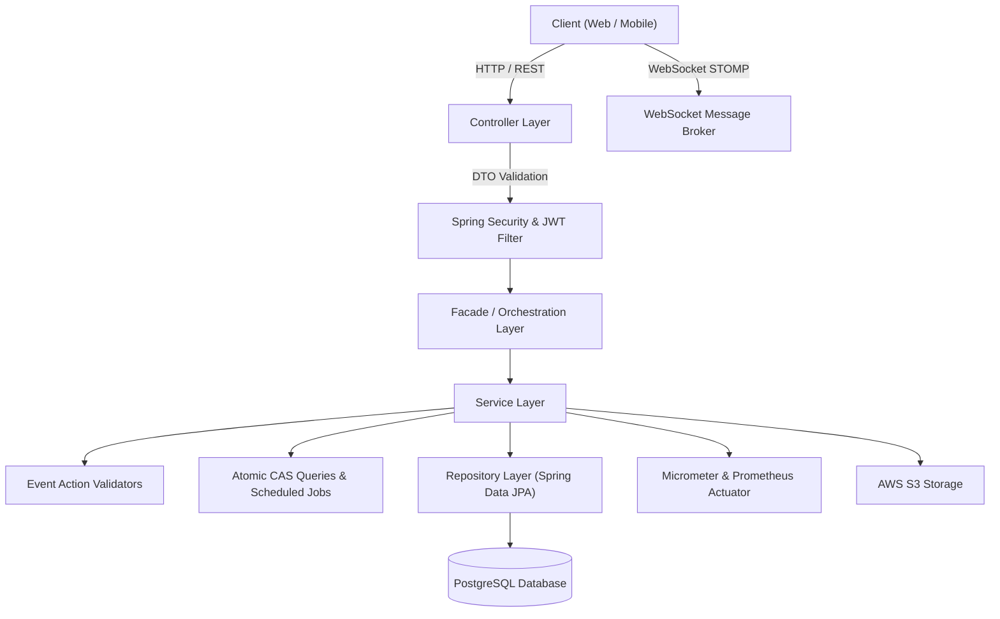

# Ticket Booking API

> A high-concurrency event ticket booking platform backend preventing double-booking and providing real-time seat reservation, payment orchestration, and monitoring.

[](https://openjdk.org/)
[](https://spring.io/projects/spring-boot)
[](https://www.postgresql.org/)
[](http://localhost:8080/swagger-ui.html)
[](https://www.docker.com/)

[//]: # ([![License]&#40;https://img.shields.io/badge/License-MIT-blue&#41;]&#40;LICENSE&#41;)

## Overview

Ticket Booking API is an event ticketing backend designed to solve the critical challenge of high-concurrency seat reservations and eliminate double-booking during flash-sale events. It serves event organizers who configure venues, ticket classes, and seating layouts, as well as customers purchasing tickets in real time. The platform provides secure multi-role authentication, transactional seat holding, third-party payment integration with webhook callbacks, and live seat updates via WebSocket STOMP.

## Key Features

- **High-Concurrency Seat Reservation (Atomic CAS):** Eliminates race conditions and double-booking using PostgreSQL Compare-and-Swap conditional queries (`UPDATE ... WHERE status = 'AVAILABLE'`).
- **Scheduled Seat Release (Cron Safety Net):** Automatically releases held `PENDING` seats back to `AVAILABLE` after 5 minutes via a 30-second recurring background job.
- **Real-Time Seat Broadcasting:** Live updates pushed to connected web clients through WebSocket STOMP topics when seats are reserved or booked.
- **Role-Based Access Control (RBAC):** Stateless authentication with JWT access tokens and database-backed refresh token rotation distinguishing `CUSTOMER` and `ORGANIZER` roles.
- **Event & Venue Lifecycle Management:** State-machine validation enforcing rules across event phases (draft, approved, published) with seat grid layout materialization and tiered pricing.
- **Payment Orchestration:** Extensible Strategy & Factory patterns supporting multiple payment gateways (e.g. VNPay, Mock) with asynchronous IPN webhook handling.
- **Cloud Asset Storage:** AWS S3 integration for event banners and poster uploads with environment segregation (`development` vs `production`).
- **Production Observability & Metrics:** Micrometer timers (p50/p95/p99 latency) and counters feeding into Prometheus and Grafana dashboards.
- **Interactive API Documentation:** Integrated Swagger UI / OpenAPI 3.0 specification with JWT Bearer authorization support.

## Tech Stack

- **Language:** Java 21
- **Framework:** Spring Boot 4.x
- **Database:** PostgreSQL (with Neon serverless / Docker)
- **Persistence:** Spring Data JPA / Hibernate, HikariCP
- **Authentication:** Spring Security + JJWT 0.12.6
- **Documentation:** Springdoc OpenAPI 2.8.5 (Swagger UI)
- **Object Storage:** AWS SDK v2 (S3)
- **Real-Time Communication:** Spring WebSocket (STOMP + SockJS)
- **Metrics & Monitoring:** Micrometer, Prometheus, Grafana
- **Testing:** JUnit 5, Mockito, Spring Boot Test
- **Deployment:** Docker, Render

## Architecture



Describe the responsibilities of the main layers:
- **Controller:** Handles HTTP requests and responses, input validation (`@Valid`), OpenAPI documentation metadata, and returns standardized `ApiResponse<T>` envelopes.
- **Orchestration / Facade:** Coordinates complex workflows across multiple domain boundaries (e.g., `EventFacade` bridging events with layout generation, `PaymentFacade` coordinating orders with payment gateways).
- **Service:** Encapsulates business logic, state-machine validation rules, and transaction boundaries (`@Transactional`).
- **Repository:** Manages data access via Spring Data JPA and executes atomic native queries for CAS seat locking.
- **Domain / Entity:** Represents business entities, relationships, database schemas, and invariants.
- **Shared / Infrastructure:** Houses cross-cutting concerns including `GlobalExceptionHandler`, scheduled cleanup jobs (`ReleaseExpiredSeatJob`), and JWT authentication filters.

## Getting Started

### Prerequisites

- JDK 21
- Maven 3.9+ (or use the included `./mvnw` wrapper)
- PostgreSQL 16+
- Docker & Docker Compose (optional, for local DB and monitoring)

### Installation

1. Clone the repository.

   ```bash
   git clone https://github.com/nghiatr/ticket-booking.git
   cd ticket-booking
   ```

2. Configure environment variables in a `.env` file at the project root.

   ```env
   # Database Configuration
   DATABASE_URL=jdbc:postgresql://localhost:5432/ticket_booking
   DATABASE_USERNAME=postgres
   DATABASE_PASSWORD=postgres

   # JWT Security
   JWT_SECRET=your_super_secret_hex_or_base64_key_at_least_256_bits
   JWT_ACCESS_TOKEN_EXPIRE_MS=86400000
   JWT_REFRESH_TOKEN_EXPIRE_MS=604800000

   # Application & Cloud
   ENV=development
   PORT=8080
   AWS_REGION=ap-southeast-1
   AWS_S3_BUCKET_NAME=ticket-booking-events
   AWS_ACCESS_KEY_ID=your_aws_key
   AWS_SECRET_ACCESS_KEY=your_aws_secret
   ```

3. Run the application.

   ```bash
   ./mvnw spring-boot:run
   ```

   *(On Windows PowerShell: `.\mvnw.cmd spring-boot:run`)*

4. Open the API documentation.

   - Swagger UI: `http://localhost:8080/swagger-ui.html`
   - OpenAPI Spec: `http://localhost:8080/v3/api-docs`

## API Documentation

| Method | Endpoint | Description | Auth |
|---|---|---|---|
| POST | `/api/v1/auth/register` | Đăng ký tài khoản người dùng mới | No |
| POST | `/api/v1/auth/login` | Đăng nhập hệ thống & nhận JWT | No |
| POST | `/api/v1/auth/refresh-token` | Cấp lại access token từ refresh token | No |
| POST | `/api/v1/auth/logout` | Đăng xuất và thu hồi refresh token | Bearer Token |
| GET | `/api/v1/venues` | Lấy danh sách địa điểm tổ chức công khai | No |
| GET | `/api/v1/events` | Lấy danh sách sự kiện công khai | No |
| GET | `/api/v1/events/{id}` | Lấy chi tiết thông tin sự kiện | No |
| GET | `/api/v1/events/my-event` | Lấy danh sách sự kiện của ban tổ chức | Organizer |
| POST | `/api/v1/events/my-event` | Tạo thông tin cơ bản sự kiện (JSON / Multipart ảnh) | Organizer |
| POST | `/api/v1/events/my-event/{id}/ticket-classes` | Khởi tạo danh sách các hạng vé | Organizer |
| PUT | `/api/v1/events/my-event/{id}/ticket-classes` | Chỉnh sửa danh sách các hạng vé | Organizer |
| GET | `/api/v1/events/my-event/{id}/ticket-classes` | Lấy danh sách hạng vé của sự kiện | Organizer |
| POST | `/api/v1/events/my-event/{id}/layout` | Khởi tạo sơ đồ vị trí ghế ngồi cho sự kiện | Organizer |
| PUT | `/api/v1/events/my-event/{id}` | Cập nhật thông tin sự kiện (JSON / Multipart ảnh) | Organizer |
| GET | `/api/v1/orders` | Lấy danh sách đơn hàng của khách hàng | Customer |
| GET | `/api/v1/orders/{id}` | Lấy chi tiết đơn hàng | Customer |
| POST | `/api/v1/orders` | Tạo mới đơn hàng và giữ chỗ các ghế đã chọn | Customer |
| POST | `/api/v1/payments` | Khởi tạo phiên thanh toán cho đơn hàng | Customer |
| GET | `/api/v1/payments/{method}/return` | Nhận kết quả điều hướng từ cổng thanh toán | No |
| GET | `/api/v1/payments/{method}/ipn` | Tiếp nhận IPN Webhook qua GET từ cổng thanh toán | No |
| POST | `/api/v1/payments/{method}/ipn` | Tiếp nhận IPN Webhook qua POST từ cổng thanh toán | No |
| GET | `/actuator/health` | Kiểm tra tình trạng hoạt động của service | No |
| GET | `/actuator/prometheus` | Xuất số liệu thống kê ứng dụng cho Prometheus | No |

For detailed schemas and interactive request testing, see Swagger UI at `/swagger-ui.html`.

## Testing

Run the test suite:

```bash
./mvnw test
```

Important test suites:
- **Unit & Validation Tests:** Tests verifying [`EventActionValidator`](src/main/java/com/nghiatr/ticket_booking/event/validation/EventActionValidator.java) state transitions and DTO constraint validations.
- **Security & JWT Tests:** Tests verifying token creation, claims extraction, expiration validation, and authorization filters.
- **Web MVC Tests:** Slice tests utilizing `@WebMvcTest` to verify controllers, HTTP status codes, and JSON response formatting.
- **Repository Tests:** Data JPA tests validating atomic queries and database constraints.

## Engineering Decisions

- **Concurrency Control (Atomic CAS over Distributed Locking):**
  Instead of introducing a distributed lock manager (like Redisson) which adds network overhead and operational complexity, the booking engine uses atomic conditional SQL updates (`UPDATE seats SET status = 'PENDING' WHERE id IN (...) AND status = 'AVAILABLE'`). PostgreSQL executes this query atomically at the row level; only one concurrent transaction acquires each seat, while losers trigger an immediate transaction rollback.
- **Transaction Boundaries & Facade Coordination:**
  Cross-aggregate operations (such as seat layout materialization or order creation with payment initiation) are coordinated via [`EventFacade`](src/main/java/com/nghiatr/ticket_booking/orchestration/EventFacade.java) and [`PaymentFacade`](src/main/java/com/nghiatr/ticket_booking/orchestration/PaymentFacade.java), keeping individual domain services decoupled while preserving atomic transaction boundaries.
- **Optimistic Seat Hold Expiration:**
  Seats held in `PENDING` status expire after 5 minutes. Rather than relying on fragile distributed timers, [`ReleaseExpiredSeatJob`](src/main/java/com/nghiatr/ticket_booking/shared/jobs/expired_seats/ReleaseExpiredSeatJob.java) runs on a 30-second cron cycle with defensive SQL filters (`AND status = 'PENDING'`) to release expired holds without affecting concurrently completed orders.
- **Centralized Error Handling:**
  Implemented with [`GlobalExceptionHandler`](src/main/java/com/nghiatr/ticket_booking/shared/handler/GlobalExceptionHandler.java) (`@RestControllerAdvice`) to convert business exceptions (`AppException`), validation violations, and database integrity errors into unified `ApiResponse<T>` envelopes with informative error codes.
- **Connection Pool Optimization:**
  HikariCP is explicitly tuned in `application.yaml` (`max-pool-size: 20`, `minimum-idle: 10`) to handle sudden connection spikes during peak booking flash sales.

## Deployment

The application is containerized with a production-ready multi-stage Dockerfile and optimized for cloud deployment on **Render**:

- **Build Image:** `maven:3.9.9-eclipse-temurin-21-alpine`
- **Runtime Image:** `eclipse-temurin:21-jre-alpine` (< 150MB total image footprint)
- **Memory Tuning:** Configured with `-XX:+UseContainerSupport -XX:MaxRAMPercentage=75.0` to safely operate within Render's 512MB RAM free tier without OOM termination.
- **Port Binding:** Automatically binds to Render's dynamic `$PORT` via `-Dserver.port=${PORT:-8080}`.
- **Monitoring Stack:** Run Prometheus & Grafana locally with:
  ```bash
  docker compose -f docker-compose.monitoring.yml up -d
  ```

## Roadmap

- [x] JWT Authentication & RBAC (Customer & Organizer)
- [x] Atomic CAS-based Concurrent Seat Reservation
- [x] Scheduled Background Job for Expired Seat Release
- [x] Multi-gateway Payment Strategy & IPN Webhook Integration
- [x] Real-time Seat Status Updates via WebSocket STOMP
- [x] OpenAPI 3.0 & Interactive Swagger UI
- [x] Multi-stage Dockerfile & Render Cloud Deployment
- [ ] Redis caching for public event catalog
- [ ] Asynchronous email ticket delivery with QR code generation
- [ ] Distributed rate limiting using Redis / Bucket4j
