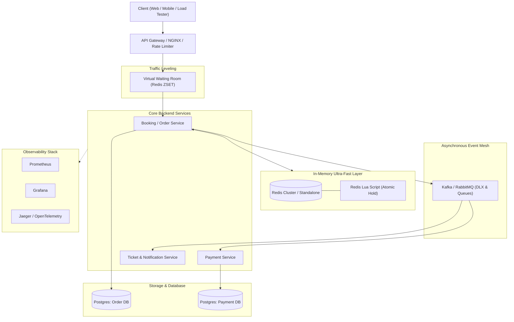

# Ticket Booking System: High-Concurrency & Microservices Architecture Blueprint

> **Mục tiêu**: Nâng cấp dự án Ticket Booking từ một Modular Monolith nền tảng thành một hệ thống phân tán chịu tải cao (High Concurrency & High Transaction), giải quyết triệt để bài toán flash-sale mở bán vé (10,000+ người tranh chấp hàng ngàn ghế cùng thời điểm), áp dụng đúng chuẩn các microservices pattern và tạo dựng hồ sơ năng lực (portfolio) vượt trội trong mắt các nhà tuyển dụng và Tech Lead.

---

## 1. Phân tích hiện trạng & Điểm nghẽn hệ thống (Bottleneck Analysis)

### 1.1. Những điểm đã làm rất tốt hiện tại
- **Java 21 & Spring Boot**: Ứng dụng công nghệ hiện đại, record/pattern matching, Virtual Threads sẵn sàng.
- **Phân chia Domain Modularity rõ ràng**: `event`, `order`, `seat`, `ticketClass`, `venue`, `user`, `auth`.
- **Tư duy Concurrency bước đầu**: Đã áp dụng Compare-And-Swap (CAS) thông qua câu lệnh:
  ```sql
  UPDATE seats SET status = :newStatus, order_id = :orderId, hold_expired_at = :expiredAt 
  WHERE seat_id IN (:seatIds) AND status = 'AVAILABLE';
  ```
  và kiểm tra `updatedCount == seatIds.size()` để tự động rollback.
- **HikariCP Pool & Metrics sơ khởi**: Cấu hình explicit pool size và đo lường Timer/Counter qua Micrometer.

### 1.2. Những điểm nghẽn (Bottlenecks) khi tải tăng lên 10,000 - 50,000 RPS
1. **Database Lock Contention & Connection Exhaustion**:
   - Khi 5,000 người cùng tranh mua 1 dãy ghế trong 1 giây, hàng nghìn giao dịch đổ dồn vào PostgreSQL.
   - HikariCP `maximum-pool-size: 20` sẽ nhanh chóng bị cạn (Connection Timeout `30000ms`), CPU của Postgres chạm ngưỡng 100% do tranh chấp hàng (Row-level lock wait) và context switching.
2. **CronJob Polling 30s giải phóng ghế hết hạn**:
   - Polling DB mỗi 30 giây bằng câu lệnh `findByStatusAndHoldExpiredAtBefore` gây áp lực I/O liên tục lên Database.
   - Độ trễ nhả ghế tối đa lên tới 30 giây (khiến ghế bị "treo", người khác phải chờ đợi vô ích).
3. **Thiếu cơ chế Hàng đợi ảo (Virtual Waiting Room)**:
   - Khi mở bán concert lớn, nếu để 100% lượng request đâm thẳng vào backend server, server sẽ sụp đổ (Cascading Failure). Cần có lớp lọc/điều tiết lưu lượng trước khi vào Core Booking.
4. **Luồng phân tán chưa khép kín (Payment & Ticket)**:
   - Hai module `payment` và `ticket` chưa hoàn thiện. Nếu tách microservices, việc xử lý Payment Webhook và xuất vé cần giải quyết triệt để bài toán **Idempotency** (chống trừ tiền 2 lần) và **Transactional Outbox / Saga Pattern** (chống mất mát dữ liệu giữa DB và Broker).

---

## 2. Danh mục Tính năng Đề xuất (Feature Roadmap)

Hệ thống bán vé sự kiện chuẩn Enterprise cần có đầy đủ các tính năng sau:

```
┌────────────────────────────────────────────────────────────────────────┐
│                        TICKET BOOKING SYSTEM                           │
├───────────────────┬───────────────────┬────────────────────────────────┤
│  1. EVENT & SEAT  │  2. CORE BOOKING  │  3. PAYMENT & ISSUANCE         │
├───────────────────┼───────────────────┼────────────────────────────────┤
│ • Interactive Map │ • Flash-Sale Hold │ • Payment Gateway Integration  │
│ • Quota & Pricing │ • Virtual Queue   │ • Idempotent Webhook Handler   │
│ • Real-time State │ • Rate Limiting   │ • Signed QR Ticket (HMAC)      │
│ • Venue Layout    │ • Auto-Release    │ • Staff Mobile Scan & Check-in │
└───────────────────┴───────────────────┴────────────────────────────────┘
```

### Nhóm 1: Quản trị sự kiện & Sơ đồ ghế động (Event & Dynamic Layout)
- **Thiết kế sơ đồ ghế đa phân khu**: Quản lý nhiều Block/Zone, hạng vé (VIP, Standard, Standing/Ga), giá tiền và giới hạn mua (max 4-5 vé/user).
- **Real-time Seat Map**: Broadcast trạng thái ghế (Trống -> Đang giữ -> Đã bán) đến toàn bộ người dùng đang mở trang qua **WebSocket (STOMP)**.

### Nhóm 2: Đặt vé & Giữ chỗ siêu tốc (High-Throughput Booking Engine)
- **Sub-10ms Seat Reservation**: Thực thi atomic check-and-lock trên **Redis bằng Lua Script** trước khi ghi nhận xuống cơ sở dữ liệu.
- **Hàng đợi ảo (Virtual Waiting Room / Queue-it Pattern)**: Phân phối số thứ tự (Token/Ticket Sequence) cho người dùng bằng Redis Sorted Set (`ZSET`), cho phép vào booking theo từng batch 200-500 users.
- **Nhả ghế chính xác theo mili-giây (Precise Expiration)**: Sử dụng **RabbitMQ Dead Letter Exchange (DLX)** hoặc **Redis Key Expiration Listener**, ghế tự động về `AVAILABLE` ngay khi hết 5 phút giữ chỗ.

### Nhóm 3: Thanh toán & Xuất vé chống gian lận (Payment & E-Ticket Lifecycle)
- **Tích hợp Cổng thanh toán (Mock/VNPay/Stripe)**: Hỗ trợ thanh toán QR code / thẻ tín dụng.
- **Idempotency Engine**: Đảm bảo mỗi giao dịch thanh toán hoặc webhook retry chỉ được thực thi đúng 1 lần (sử dụng `Idempotency-Key` header và Redis Distributed Lock).
- **E-Ticket với QR Code ký số**:
  - Sinh mã vé chứa Payload: `ticketId | orderId | eventId | timestamp` được bọc bởi chữ ký số `HMAC-SHA256`.
  - Không thể làm giả bằng cách tự sửa mã QR.
- **Cổng soát vé (Check-in Gate Scanner)**:
  - API quét QR vé tại cổng sự kiện: Xác thực vé hợp lệ, cập nhật trạng thái `CHECKED_IN`, chống quét vé 2 lần.

---

## 3. Kiến trúc Công nghệ & Các Design Patterns Chuyên sâu



### 3.1. Danh mục Công nghệ Đề xuất (Tech Stack)

| Lớp (Layer) | Công nghệ đề xuất | Lý do & Giá trị mang lại |
|---|---|---|
| **Core Framework** | Java 21, Spring Boot 3.3+ / 4.x | Virtual Threads (Project Loom) tăng throughput I/O lên gấp 5-10 lần so với thread pool truyền thống. |
| **In-Memory Cache & Lock** | **Redis (Redisson / Spring Data Redis)** | Lưu trữ trạng thái ghế in-memory, chạy Lua Script nguyên tử, quản lý Distributed Lock và Rate Limiting. |
| **Message Broker** | **Apache Kafka** hoặc **RabbitMQ** | Tách rời luồng xử lý (Decoupling), điều tiết tải (Backpressure), truyền nhận sự kiện đặt vé, thanh toán, nhả ghế. |
| **Primary Database** | **PostgreSQL** | Dữ liệu quan hệ, ACID transaction, JSONB linh hoạt cho sơ đồ ghế, tối ưu Indexing. |
| **Real-time Sync** | **Spring WebSocket + STOMP** | Đẩy sự kiện thay đổi trạng thái ghế xuống giao diện người dùng theo thời gian thực. |
| **Reliability & Resilience** | **Resilience4j** | Circuit Breaker, Retry, Rate Limiter bảo vệ hệ thống khỏi lỗi dây chuyền (Cascading failures). |
| **Tracing & Monitoring** | **OpenTelemetry + Jaeger / Loki + Prometheus + Grafana** | Giám sát toàn diện (Full-stack Observability): Tracing từng request đi qua các service, đo RED metrics (Rate, Errors, Duration). |
| **Performance Testing** | **k6 (Grafana)** | Viết test script bằng JavaScript giả lập 5,000 - 20,000 người dùng đồng thời tranh chấp vé, xuất báo cáo HTML/Grafana. |

---

### 3.2. Bốn Kiến trúc/Pattern Sống Còn để Thể hiện Tư duy Microservices

#### 1. Lua Scripting trên Redis cho Atomic Seat Holding
- **Vấn đề**: Nếu dùng Database CAS, 10,000 request đè vào DB sẽ làm nghẽn connection pool. Nếu đọc Redis rồi ghi lại Redis bằng code Java (Read-Modify-Write) sẽ bị Race Condition (2 thread đọc cùng thấy AVAILABLE).
- **Giải pháp**: Viết Lua Script thực thi trực tiếp trên Redis Engine (chạy đơn luồng nguyên tử - single-threaded atomic).
- **Logic Lua Script**:
  ```lua
  -- KEYS: Seat keys (e.g. seat:101, seat:102)
  -- ARGV[1]: Order ID, ARGV[2]: Expiry seconds (300)
  for i, key in ipairs(KEYS) do
      local status = redis.call('GET', key)
      if status and status ~= 'AVAILABLE' then
          return 0 -- Fail: có ghế đã bị giữ
      end
  end
  for i, key in ipairs(KEYS) do
      redis.call('SET', key, 'HELD:' .. ARGV[1], 'EX', ARGV[2])
  end
  return 1 -- Thành công giữ toàn bộ ghế
  ```
  *Kết quả: Thời gian giữ ghế giảm từ ~50-100ms (Postgres) xuống còn **2-5ms (Redis)**.*

#### 2. Transactional Outbox Pattern & CDC (Change Data Capture)
- **Vấn đề**: Khi Order Service lưu Order vào DB và gửi message sang Kafka:
  - Nếu commit DB thành công nhưng Kafka bị sập -> Message thất lạc.
  - Nếu gửi Kafka trước nhưng DB commit lỗi -> Khách hàng bị xử lý thanh toán cho đơn hàng không tồn tại!
- **Giải pháp**: Lưu event vào bảng `outbox_events` trong **cùng local transaction với Order**. Một Worker (hoặc Debezium đọc WAL log) sẽ đọc bảng outbox và đẩy vào Kafka đảm bảo **At-least-once delivery**.

#### 3. Saga Pattern (Choreography-based) cho Luồng Booking -> Payment
- Gồm chuỗi các Local Transaction:
  1. `OrderService`: Tạo Order (PENDING) -> Bắn event `OrderCreated`.
  2. `PaymentService`: Lắng nghe event -> Gọi cổng thanh toán:
     - Nếu Thành công: Bắn event `PaymentSucceeded`.
     - Nếu Thất bại / Hết hạn: Bắn event `PaymentFailed`.
  3. `OrderService`:
     - Nhận `PaymentSucceeded` -> Chuyển trạng thái `CONFIRMED`.
     - Nhận `PaymentFailed` -> Kích hoạt **Compensating Transaction** (Giao dịch bù trừ): Chuyển Order sang `CANCELLED`, gọi Redis/DB nhả ghế về `AVAILABLE`.

#### 4. Idempotency Key Pattern
- Mọi request nhạy cảm (Tạo đơn hàng, Xác nhận thanh toán) phải mang header `Idempotency-Key: <UUID>`.
- Server lưu key này vào Redis với TTL 24h. Nếu client bấm 2 lần do mạng lag hoặc Payment Gateway retry webhook 5 lần, server phát hiện duplicate và trả về kết quả đã xử lý trước đó mà không trừ tiền/tạo đơn lần 2.

---

## 4. Lộ trình Thực hiện & Học Song Song 5 Giai đoạn (Learning & Build Plan)

Lộ trình được thiết kế theo nguyên lý **"Evolutionary Architecture" (Tiến hóa kiến trúc)**: Bắt đầu từ tối ưu Modular Monolith vững chắc, sau đó đưa In-Memory & Event-Driven vào, và hoàn thiện các Microservices Patterns.

```mermaid
gantt
    title Lộ trình 5 Giai đoạn Phát triển & Nâng cấp Hệ thống
    dateFormat  X
    axisFormat Phase %d
    section Phase 1
    Domain Completion & Payment (Monolith) :active, p1, 0, 15
    section Phase 2
    Redis Lua Engine & Concurrency Upgrade :p2, 15, 30
    section Phase 3
    Event-Driven & Microservices Patterns   :p3, 30, 45
    section Phase 4
    Virtual Waiting Room & Security        :p4, 45, 55
    section Phase 5
    Benchmark, Observability & Showcase    :p5, 55, 70
```



---

### Giai đoạn 1: Hoàn thiện Nghiệp vụ & Module Thanh toán / Xuất vé (Week 1 - 2)
> **Mục tiêu**: Đưa hệ thống hiện tại về trạng thái "Chạy đầy đủ nghiệp vụ từ A -> Z" (End-to-end functional).

#### Công việc thực hiện (Deliverables)
1. **Module Payment**:
   - Xây dựng Entity `Payment`, `PaymentStatus` (PENDING, SUCCESS, FAILED, REFUNDED).
   - Mock Payment Gateway Service (tạo URL thanh toán giả lập có xác nhận OTP / simulate success-fail).
   - Viết API Webhook nhận callback thanh toán có xử lý `Idempotency-Key`.
2. **Module Ticket & Check-in**:
   - Sau khi thanh toán thành công, tự động sinh các thực thể `Ticket`.
   - Tạo mã hash `HMAC-SHA256(ticketId + secretKey)` và nhúng vào dữ liệu QR Code.
   - Viết API `POST /api/tickets/check-in` cho nhân viên soát vé quét và xác thực QR Code.
3. **Unit & Integration Test với Testcontainers**:
   - Viết test kiểm tra CAS seat booking và Webhook thanh toán bằng Spring Boot Test kết hợp Docker Testcontainers (PostgreSQL thật).

#### Kiến thức học song song
- Quản lý Database Transaction (`@Transactional`, Isolation Levels: READ_COMMITTED vs REPEATABLE_READ vs SERIALIZABLE).
- Thiết kế Idempotency trong hệ thống tài chính/thanh toán.
- Ký số dữ liệu và bảo mật QR Code.

---

### Giai đoạn 2: Bứt phá Hiệu năng với In-Memory High-Concurrency Engine (Week 3 - 4)
> **Mục tiêu**: Chuyển bài toán giữ ghế từ Database I/O sang In-memory (Redis), đưa thời gian phản hồi từ ~100ms xuống sub-10ms.

#### Công việc thực hiện (Deliverables)
1. **Tích hợp Spring Data Redis & Redisson**:
   - Mở comment dependency Redis trong `pom.xml`, cấu hình Redis connection pool.
2. **Xây dựng Redis Lua Script cho Giữ ghế (Seat Reservation)**:
   - Viết Lua Script kiểm tra và giữ nhiều ghế cùng lúc (Atomic Multi-Key Hold).
   - Đồng bộ trạng thái: Giữ trên Redis trước, sau đó ghi bất đồng bộ (Write-Behind) hoặc đồng bộ transaction xuống Postgres.
3. **Cơ chế Nhả ghế chính xác (Precise TTL Release)**:
   - Loại bỏ hoặc giảm tần suất polling của Scheduled Job 30s.
   - Sử dụng **RabbitMQ Delayed Message Exchange** hoặc **Redis Key Expiration Notification** để kích hoạt giải phóng ghế đúng từng giây khi hết 5 phút.
4. **Real-time Seatmap với WebSocket (STOMP)**:
   - Khi ghế chuyển trạng thái `AVAILABLE -> HELD -> BOOKED`, bắn message qua WebSocket `/topic/events/{eventId}/seats`.
   - Client tự động đổi màu ghế trên UI theo thời gian thực mà không cần F5.

#### Kiến thức học song song
- Hiểu sâu cơ chế đơn luồng của Redis và tại sao Redis Lua Script đảm bảo tính nguyên tử (Atomicity).
- Caching Patterns: Cache-Aside, Write-Through, Write-Behind, Cache Avalanche, Cache Stampede, Cache Penetration.
- Giao thức WebSocket, STOMP protocol qua Message Broker.

---

### Giai đoạn 3: Chuyển dịch Event-Driven & Microservices Patterns (Week 5 - 6)
> **Mục tiêu**: Tách biệt trách nhiệm giữa Booking, Payment và Notification, loại bỏ tình trạng thắt nút cổ chai (Decoupled Architecture).

#### Công việc thực hiện (Deliverables)
1. **Tích hợp Message Broker (Kafka hoặc RabbitMQ)**:
   - Thiết lập cụm Broker qua Docker Compose.
   - Định nghĩa các Events: `OrderPlacedEvent`, `PaymentCompletedEvent`, `PaymentFailedEvent`, `SeatReleasedEvent`.
2. **Triển khai Transactional Outbox Pattern**:
   - Tạo bảng `outbox_events` trong Database.
   - Khi tạo đơn, lưu event vào `outbox_events` trong cùng một transaction.
   - Viết một Scheduled Poller / Debezium CDC bắn event lên Kafka, cam kết At-least-once Delivery (không bao giờ mất sự kiện).
3. **Triển khai Saga Pattern (Choreography)**:
   - Xây dựng luồng tương tác bất đồng bộ: `Order Placed -> Payment Processed -> Ticket Generated -> Email Notification Sent`.
   - Xử lý kịch bản lỗi: Nếu Payment fail sau 5 phút -> Kích hoạt Compensating Transaction để hủy đơn và nhả ghế.
4. **Consumer Idempotency**:
   - Sử dụng bảng `processed_events` để đảm bảo mỗi consumer chỉ xử lý 1 message duy nhất dù Kafka rebalance hoặc gửi lại.

#### Kiến thức học song song
- Định lý CAP và Eventual Consistency (Tính nhất quán sau cùng).
- Dual-Write Problem và tại sao Outbox Pattern là chuẩn mực công nghiệp.
- Thiết kế Partition Key trong Kafka để đảm bảo thứ tự message theo từng Event hoặc User.

---

### Giai đoạn 4: Hàng đợi ảo (Virtual Waiting Room) & Phòng thủ Tải đỉnh (Week 7)
> **Mục tiêu**: Bảo vệ hệ thống trước đợt tấn công từ chối dịch vụ (DDoS), Bot tự động và hàng vạn request cùng ập tới vào giờ mở bán.

#### Công việc thực hiện (Deliverables)
1. **Virtual Waiting Room với Redis Sorted Set (`ZSET`)**:
   - Khi sự kiện mở bán, request vượt ngưỡng sẽ được xếp vào hàng đợi: `ZADD waiting_room:event_123 <timestamp> <userId>`.
   - API trả về cho Client: "Bạn đang đứng ở vị trí 1,245. Vui lòng chờ...".
   - Một background task xả dần (Drain) từng batch (ví dụ 100 users/giây) và cấp một Pass Token (JWT ngắn hạn 2 phút) để user tiến vào trang chọn ghế và đặt vé.
2. **Rate Limiting & Anti-Bot**:
   - Cài đặt Redis Token Bucket hoặc Sliding Window Rate Limiter bằng Bucket4j hoặc Redis.
   - Giới hạn: Mỗi IP/User không được gọi quá 5 requests/giây ở các endpoint nhạy cảm.

#### Kiến thức học song song
- Các thuật toán Rate Limiting: Token Bucket, Leaky Bucket, Sliding Window Counter.
- Cách thiết kế hệ thống Hàng đợi ảo (học hỏi từ case study của Queue-it và Ticketmaster).

---

### Giai đoạn 5: Stress Test, Full Observability & Đóng gói Showcase (Week 8)
> **Mục tiêu**: Tạo bằng chứng số liệu thuyết phục (Data-driven evidence) và đóng gói dự án để phỏng vấn.

#### Công việc thực hiện (Deliverables)
1. **Full Observability Stack**:
   - Prometheus thu thập metrics (JVM Heap, Virtual Threads, Hikari pool, Redis ops/s, Kafka lag).
   - Grafana Dashboard: Tạo 1 dashboard trực quan hiển thị RPS, p95/p99 Latency, Success/Error Rate.
   - OpenTelemetry + Jaeger: Truy vết distributed trace từ API Gateway -> Order Service -> Kafka -> Payment Service.
2. **Stress Testing với k6**:
   - Viết kịch bản test mô phỏng kịch bản thực tế:
     - 10,000 người dùng đồng thời tranh chấp 1,000 vé trong 60 giây.
   - Thu thập số liệu so sánh:
     - **Baseline**: CAS trên PostgreSQL (RPS: ~300 - 500, Latency: ~200ms, DB connection bottleneck).
     - **Tối ưu**: Redis Lua Script + Virtual Waiting Room (RPS: ~4,000 - 8,000, Latency: < 15ms, 0% double-booking).
3. **Tài liệu hóa Repository**:
   - Cập nhật `README.md` theo chuẩn quốc tế: Có sơ đồ kiến trúc (C4 Model), bảng so sánh Benchmark trước/sau, hướng dẫn chạy 1-click bằng `docker compose`.

---

## 5. Chiến lược Phỏng vấn & Thuyết phục Nhà tuyển dụng (Interview Showcase)

Khi phỏng vấn cho các vị trí Backend / Java Engineer / System Design, các câu hỏi điển hình bạn sẽ gặp và cách trả lời dựa trên dự án này:

### Câu hỏi 1: "Làm thế nào bạn giải quyết triệt để bài toán Double-Booking (bán 1 ghế cho 2 người)?"
- **Cách trả lời chuẩn Senior**:
  > *"Em tiếp cận bài toán theo 2 cấp độ bảo vệ (Defense in Depth):*
  > *1. **Lớp thứ nhất (In-Memory)**: Em sử dụng Redis Lua Script. Khi request đến, Lua Script chạy đơn luồng nguyên tử trên Redis kiểm tra trạng thái toàn bộ ghế yêu cầu. Nếu còn trống, chuyển sang HELD và set TTL 5 phút. Quá trình này chỉ mất 2-3ms, lọc bỏ 99% các request đến sau.*
  > *2. **Lớp thứ hai (Database Integrity)**: Tại PostgreSQL, em dùng CAS query `UPDATE seats ... WHERE seat_id IN (...) AND status = 'AVAILABLE'` kết hợp Unique Constraint. Nếu có bất kỳ sự sai lệch nào giữa Redis và DB, database sẽ chặn lại và transaction được rollback.*
  > *Em đã stress test kịch bản 10,000 concurrent requests tranh mua 500 ghế bằng k6 và đạt 100% data integrity, hoàn toàn không có trường hợp double-booking."*

### Câu hỏi 2: "Tại sao không tách Microservices ngay từ đầu mà lại phát triển theo Modular Monolith rồi mới tiến hóa?"
- **Cách trả lời**:
  > *"Theo nguyên lý của Martin Fowler, 'Monolith First' giúp chúng ta hiểu sâu domain boundaries mà không phải chịu chi phí vận hành (Network overhead, distributed debugging, data serialization). Em thiết kế các module `order`, `seat`, `payment` hoàn toàn độc lập về logic, giao tiếp qua Facade và Domain Events. Khi tải tăng cao ở khâu đặt vé, em dễ dàng trích xuất (extract) Core Booking Engine ra thành service độc lập và kết nối qua Kafka mà không làm xáo trộn toàn bộ kiến trúc."*

### Câu hỏi 3: "Bạn giải quyết bài toán Dual-Write giữa Database và Message Broker như thế nào?"
- **Cách trả lời**:
  > *"Em áp dụng Transactional Outbox Pattern. Em không gọi Kafka trực tiếp bên trong `@Transactional` của Order Service vì nếu mạng chập chờn, DB đã commit mà Kafka fail sẽ gây bất đồng bộ. Thay vào đó, event được lưu vào bảng `outbox_events` cùng transaction với Order. Một poller/Debezium sẽ đọc bảng này và đẩy lên Kafka với cơ chế retry và idempotency ở consumer, đảm bảo tính At-least-once delivery."*

---

## 6. Bảng Tóm tắt Công nghệ & Tính năng Ưu tiên Thực hiện Ngay

| Thứ tự | Hạng mục | Công nghệ | Thời gian dự kiến | Độ ưu tiên |
|---|---|---|---|:---:|
| 1 | Hoàn thiện Payment Webhook & Mock Gateway | Spring Boot, JPA, HMAC-SHA256 | 3 - 4 ngày | **P0** (Cốt lõi) |
| 2 | Kích hoạt Redis & Viết Lua Script Giữ ghế | Redis, Spring Data Redis, Lua | 4 - 5 ngày | **P0** (Hiệu năng) |
| 3 | Precise Seat Release với RabbitMQ DLX | RabbitMQ, Dead Letter Queue | 3 ngày | **P1** (Trải nghiệm) |
| 4 | WebSocket STOMP Sync Seatmap | Spring WebSocket, STOMP, SockJS | 3 ngày | **P1** (Tính năng) |
| 5 | Transactional Outbox & Saga với Kafka | Apache Kafka, Spring Kafka | 5 - 7 ngày | **P0** (Microservices) |
| 6 | Virtual Waiting Room (ZSET) & Rate Limiting | Redis Sorted Set, Bucket4j | 4 ngày | **P1** (High Traffic) |
| 7 | k6 Benchmark Script & Grafana Dashboard | k6, Prometheus, Grafana, OpenTelemetry | 4 - 5 ngày | **P0** (Showcase) |
